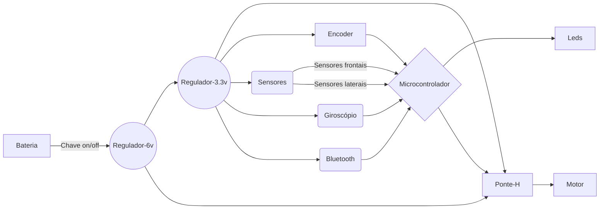
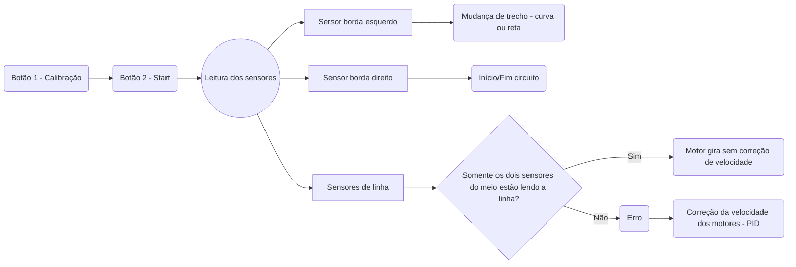

# Follow Line - Folou

## Esquemático Follow

O esquemático do Follow possui 2 regulações de tensão. Sendo elas: 
* 8.4v para 6v;
* 6v para 3.3v.

A tensão de 8.4v é referente a bateria de 2s utilizada no projeto. A tensão de 6v vai para a porta de tensão dos motores na ponte-h. Já a tensão de 3.3v alimenta os sensores de borda, os encoderes, o módulo bluetooth, os leds de indicação, a porta de tensão lógica de referência da ponte-h, o microcontrolador e o sensor giroscópio.

Quanto a funcionalidade de cada componente, o **STM32** controla o funcionamento do seguidor de linha. A **ponte-h** ([TB6612FNG](https://pdf1.alldatasheet.com/datasheet-pdf/view/807693/TOSHIBA/TB6612FNG.html)) utilizada  controla a velocidade e o sentido dos motores. Os [**encoders**](https://www.pololu.com/product/2598) funcionam como sensores que conseguem captar a velocidade de rotação dos motores. Os **sensores de borda** ([QRE-1113](https://pdf1.alldatasheet.com/datasheet-pdf/view/54347/FAIRCHILD/QRE1113.html)) são responsáveis por ler a pista e informar ao microcontrolador as ações a serem executadas.  

O **sensor giroscópio** ([MPU6050](https://pdf1.alldatasheet.com/datasheet-pdf/view/1132807/TDK/MPU-6050.html)) detecta a velocidade angular do Follow, ou seja, ele consegue corrigir a movimentação de modo a tornar o robô mais estável. Já o **módulo bluetooth** possibilita a alteração de parâmetros do código sem cabos. 

A **placa do Folou** pode ser aberta no Altium pelo link: [clique aqui](https://drive.google.com/file/d/1bIMbuUDfYTGX7AZl_Yzk-90sEEceC01L/view?usp=share_link). 

Já a **lista de componentes** utilizados, inclusive capacitores e resistores pode ser encontrada mais facilmente no link: [clique aqui](https://drive.google.com/file/d/1mZapJbVWj3NlYjh2zEogA1wd6Zr_QdYQ/view?usp=share_link)

## Código Follow 

O Folou possui dois botões, sendo um deles responsável pela calibração. Esse processo é responsável por definir o que o robô deve entender como sendo branco ou preto. Lembrando que o sensor QRE-1113 é um sensor de refletância. Dessa forma, quando este identifica a cor "preta", o sensor informa um valor alto e, no caso caso do "branco", um valor baixo. O código da calibração e do controle de velocidade dos motores já encontram-se comentadas no código atual do follow.  

Já em relação ao PID (Proporcional, Derivado e Integral), ele é um dos esquemas de controle mais comuns. Há muitas maneiras de ajustar um loop PID.

Pense no PID como uma simples mola. Uma mola tem um comprimento original que, quando perturbada por expansão ou contração, tende a recuperar seu comprimento original no menor tempo possível. Da mesma forma, um algoritmo PID em um sistema possui um valor definido de uma determinada grandeza física a ser controlada, chamada de 'ponto de ajuste', que quando alterado por algum motivo, o sistema controla os outros recursos necessários nele, para recuperar ao ponto de ajuste original no menor tempo possível. Os controladores PID são usados ​​sempre que há necessidade de controlar uma grandeza física e torná-la igual a um valor especificado. 

Para melhor entender, sugerimos a leitura das informações disponibilizadas por esse [site](https://www.instructables.com/Line-Follower-Robot-PID-Control-Android-Setup/).

Quanto ao funcionamento geral e básico do código, deve-se compreender o esquemático abaixo:

## ST-Link / Windows
Abaixo encontram-se os procedimentos para conseguir passar corretamente o código para o STM32 do Folou, utilizando-se o VS Code. Tais procedimentos também podem ser visualizados no vídeo [tutorial](https://www.youtube.com/watch?v=mOzsBYo3h4M&ab_channel=TechHelp).

Antes de passar o código, é preciso passar o bootloader no STM32. Para realizar esse processo, deve-se colocar pelo menos um jumper na posição 1 (um) do STM e fazer o download  do [ST-Link Utility](https://www.st.com/en/development-tools/stsw-link004.html) e abrir, dentro do programa baixado e instalado, o arquivo [generic_boot20_pc13.bin](https://github.com/rogerclarkmelbourne/STM32duino-bootloader/tree/master/binaries). Dentro do ST-Link Utility:

 1. `File -> Open file -> generic_boot20_pc13.bin`
 2. `Target -> Connect -> Automatic mode -> Start`
 3. `Stop -> Target -> Disconnect`

Após realizar esses procedimentos, deve-se retornar o jumper no STM para a posição 0 (zero).

## GitHub

GitHub é uma espécie de "rede social para programadores" e é o ambiente de modificação, armazenagem e compartilhamento de código dentro do TROIA. Por isso, é importante conhecer como modificar o código do GitHub no VSCode. 

1. Copie o link disponibilizado dentro da pasta do Follow no GitHub.   
`Code -> HTTPS -> <copiar link disponibilizado>`
2. Caso seu computador não tenha [git](https://gitforwindows.org/), faça o download e instale na sua máquina com Windowns.  
3. Caso não esteja criada, deve-se criar uma pasta de repositório no computador. (*Recomendamos criar dentro da pasta "Documentos"*). 
4. Dentro da pasta criada, clique com o botão direito e selecione:  
`Git Bash Here`
5. Dentro do terminal, digite:  
`git clone <link copiado no passo 1>`. 
6. Abra o VSCode.

## VS Code

O [VSCode](https://code.visualstudio.com/download) é o editor de código-fonte padrão do TROIA. Seu uso é altamente recomendado devido a sua facilidade e praticidade. Para começar a desenvolver, é necessário a instalação de algumas extensões:

1. Git Lens;
2. Platformio;
3. C/C++;
4. C/C++ extension Pack;
5. Portuguese (Brazil) Language Pack for Visual Studio Code.
6. **Sugestões de extensões pra ficar bonitinho:** Dracula Official ; Rainbow Brackets ; vscode-icons.  

>### Conceitos importantes 
Antes de se utilizar o VS Code, é importante entender que o GitHub funciona como se fosse um armazém de códigos e o VS, o editor. Dessa forma, deve-se perceber que o código pode estar, ora no armazenamento local *(ou seja, armazenado no computador)*, ora na nuvem *(ou seja, após o upload para o GitHub)*. Tendo isso em mente e as informações detalhadas nesse [vídeo](https://www.youtube.com/watch?v=HIqyLRKv-YE&ab_channel=ThiCode), é importante pontuar alguns conceitos:

* **Branch:** Em tradução literal, significa “ramo”. No mundo da programação, ela tem o mesmo significado: uma branch é uma ramificação do seu projeto. 

* **Merge:** Permite que você pegue as linhas de desenvolvimento independentes criadas em um branch e as integre em uma ramificação única (processo de mesclagem).

* **Pull:** É usado para buscar e baixar conteúdo de repositórios remotos e fazer a atualização imediata ao repositório local para que os conteúdos sejam iguais. 

* **Push:**  É usado para enviar o conteúdo do repositório local para um repositório remoto. O comando push transfere commits do repositório local a um repositório remoto.

* **Commit:** No contexto de ciência da computação, gerenciamento de dados e controle de versão, commit refere-se ao processo de tornar permanente um conjunto de alterações, ou seja, de efetivar as alterações.  

Caso tenha interesse em aprender melhor sobre esses comandos git, veja esse vídeo, o qual é dividido em: [parte 1](https://www.youtube.com/watch?v=Ckig8H_h538&ab_channel=ThiCode) e [parte 2](https://www.youtube.com/watch?v=o_ECnZ8zk_Q&ab_channel=ThiCode).
